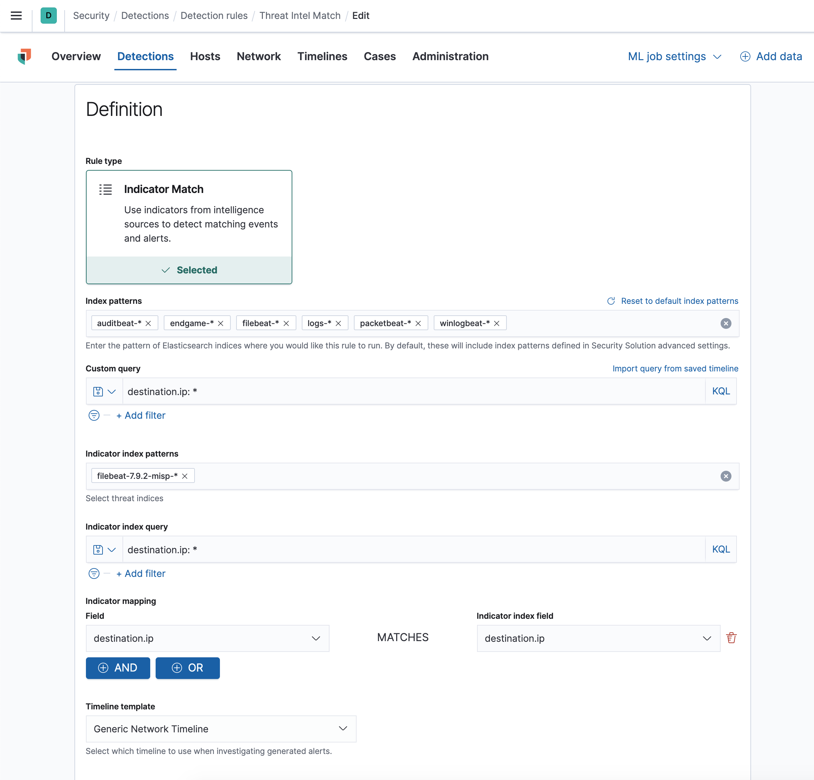

# MISP Importer

misp-importer uses the filebeat misp module to import threat intel events into Elasticsearch. Why? In my tests filebeat duplicated events every time it ran, so I needed a way to keep the index current. 

If used with Elastic stack 7.10 you can then use the TI matching capability to match indicators in any ECS (Elastic Common Schema) field - pretty neat!

## How does it work?

misp-importer uses filebeat to read the events from MISP and stash them in Elasticsearch. It is designed to run as a kubernetes cronJob and by default it will run once a day and: 

1. delete the misp index, i.e: filebeat-ver-misp-date! You have been warned!
2. Import the events from MISP into Elasticsearch.

## Quick start

1. Copy misp-importer.yaml.template to misp-importer.yaml
2. Customise misp-importer.yaml to your liking. misp-importer defaults to misp-importer namespace by default. Make sure to set the MISP_INDEX variable!
3. Create the kubernetes secrets:
```
 k create secret generic misp-importer-misp --from-literal=apikey='protecting aussie businesses' --from-literal=url='threatbear cybersecurity'
```
and then create elastic credentials:

```
k create secret generic misp-importer-elasticsearch --from-literal=username='blahblah' --from-literal=password='audit' --from-literal=host='elastos.threatbear.co' --from-literal=port='9243'
```
4. kubectl apply -f misp-importer.yaml
5. Setup a rule in Elastic SIEM like below



## TODO

1. MISP_INDEX is partially hardcoded. Change this so filebeat versions don't wreck this!
